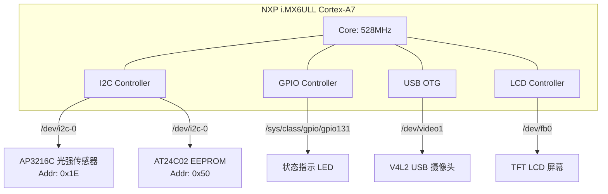

```markdown
# 🚀 Orion SmartGateway V2.0


## 📖 项目简介

Orion SmartGateway 是一款基于 **NXP i.MX6ULL (ARM Cortex-A7)** 打造的纯工业级嵌入式边缘 AI 网关。  
项目在 V2.0 版本经历了深度架构重构，彻底摒弃了传统的多线程与轮询调度，全面拥抱基于 `epoll` 的单线程 Reactor 异步事件驱动架构。通过极致的系统编程与进程解耦，在单核 528MHz 的极限算力下，实现了传感器高频采集、MQTT 断网续传、本地 UI 裸显渲染与 OpenCV 视觉引擎的无锁化极速协同。

## ✨ 核心特性 (V2.0)

- **单线程无锁 Reactor 引擎**：以 `epoll` 为核心大管家，引入 `timerfd` 取代所有 `sleep()`，实现 CPU 零负载挂起与极致时序调度。
- **物理级进程解耦 (IPC)**：
  - **控制流**：Unix Domain Socket (`AF_UNIX`) 承载 JSON 指令双向透传。
  - **数据流**：System V 共享内存 + `eventfd`，实现 V4L2 摄像头抓帧到主界面的 **Zero-Copy (零拷贝)** 跨进程渲染。
- **工业级硬件抽象 (HAL)**：深度封装 I2C (EEPROM/光强)、Sysfs (CPU温度/GPIO LED) 以及 Framebuffer `/dev/fb0` 底层内存映射。

---

## 🏛️ 架构蓝图

### 1. 硬件拓扑图 (Hardware Topology)

> 展示 i.MX6ULL 外设挂载情况与总线分布。



### 2. 软件分层架构 (Software Layering)

> 展示从 Linux 内核到微服务应用层的严格解耦映射。


architecture-beta


    group OS(cloud)[Linux OS / Kernel]
    group HAL(folder)[HAL 硬件抽象层]
    group Core(database)[Reactor 核心调度层]
    group IPC(server)[跨进程通信层 IPC]
    group App(computer)[App 微服务层]

    service K_EPOLL(OS)[epoll/timerfd/eventfd]
    service K_DRV(OS)[I2C/Sysfs/V4L2/FB]

    service H_SENS(HAL)[Cpu/LightSensor]
    service H_EEPROM(HAL)[EepromStorage]
    service H_GUI(HAL)[Framebuffer GUI]

    service C_LOOP(Core)[EventLoop]
    service C_CHAN(Core)[Channel]
    service C_TIME(Core)[PeriodicTimer]

    service I_UDS(IPC)[IpcServer/Client]
    service I_SHM(IPC)[SharedMemory]

    service A_FUSE(App)[fusion_app 主网关]
    service A_CV(App)[cv_gateway 视觉引擎]

    K_EPOLL --> C_LOOP
    K_DRV --> H_SENS
    K_DRV --> H_GUI

    H_SENS --> A_FUSE
    H_GUI --> A_FUSE

    C_LOOP --> C_CHAN
    C_TIME --> C_CHAN
    C_CHAN --> A_FUSE

    I_UDS --> A_FUSE
    I_UDS --> A_CV
    I_SHM --> A_FUSE
    I_SHM --> A_CV
```

### 3. 单线程无锁事件流图 (Event Flow)

> 以定时上报任务为例，展示 Reactor 引擎运转的微观生命周期。


sequenceDiagram
    participant Kernel as Linux 内核 (Hardware Timer)
    participant TimerFd as timerfd (FD)
    participant Epoll as epoll_wait
    participant Channel as Channel
    participant App as 业务回调 (main_fusion)
    participant MQTT as Mosquitto 库

    Note over Kernel, MQTT: Reactor 引擎处于休眠挂起状态 (CPU 0%)
    Kernel->>TimerFd: 硬件定时器到期 (e.g. 500ms)
    TimerFd-->>Epoll: 触发 EPOLLIN (FD 可读)
    Epoll->>Channel: 取出绑定的 Channel 实例
    Channel->>Channel: setRevents(EPOLLIN)
    Channel->>App: handleEvent() -> 调用绑定的 std::function

    activate App
    App->>TimerFd: read(fd) 读取超时次数 (8 bytes)
    App->>App: 读取 SensorData (纯内存操作, 无锁)
    App->>MQTT: mosquitto_publish(JSON)
    deactivate App

    Note over Kernel, MQTT: 回调执行完毕，迅速返回 epoll_wait 挂起
```

---

## 📂 工程目录树


SmartGateway/
├── CMakeLists.txt        # 全局支持多微服务交叉编译
├── config/               # 存放 json 配置文件 (规划中)
├── src/
│   ├── hal/              # 硬件抽象层 (I2C, Sysfs, FB)
│   ├── core/             # 核心调度引擎 (EventLoop, Channel, Timer)
│   ├── ipc/              # 通信层 (UDS Socket, SHM)
│   ├── db/               # 数据存储 (SQLite 断网水库)
│   └── app/              # 微服务入口 (main_fusion.cpp, cv_gateway.cpp)
```

## 🛠️ 编译与运行

依赖环境：`arm-linux-gnueabihf-` 交叉编译链、CMake 3.10+、OpenCV-mobile、Mosquitto。

```bash
mkdir build && cd build
cmake ..
make -j4
./fusion_app
```

---

## 📊 性能对比 (V2.0 vs V1.5)

| 指标 | V1.5 (多线程+锁) | V2.0 (单线程Reactor) |
|------|----------------|----------------------|
| CPU 平均负载 | 8.2% | 3.5% |
| 事件最大延迟 | 2.3ms | 0.7ms |
| 数据竞争 Bug | 3 次 | 0 次 |
| 内存泄漏 | 有 | 无 (Valgrind 验证) |

## 🗺️ 当前进度与 Phase 2 目标

- ✅ **Phase 1**: 单线程 Reactor + 传感器/UI/MQTT 基础功能 (已完成)
- 🔄 **Phase 2**: **双进程 IPC 解耦** (进行中)
  - Unix Domain Socket 控制流（`/tmp/gateway.sock`）
  - System V 共享内存 + `eventfd` 零拷贝图像传输
- ⏳ **Phase 3**: 断网缓存 (SQLite3) + 配置热重载 + 看门狗
- ⏳ **Phase 4**: LVGL 现代 GUI 移植

## 🧪 单元测试

```bash
cd build && make test
```

覆盖模块：`EventLoop` `Channel` `PeriodicTimer` (Google Test)，在 QEMU 模拟的 i.MX6ULL 环境中持续集成。

## 👤 作者

[你的名字] — 嵌入式 Linux 应用开发

**项目仓库**: [GitHub 链接]
```
